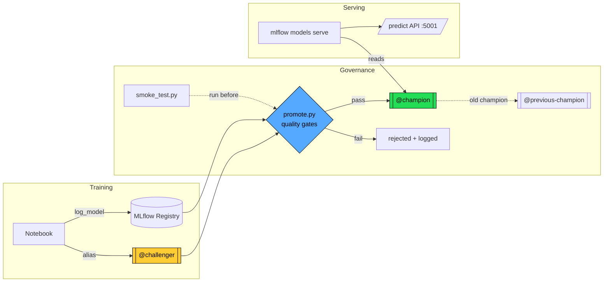
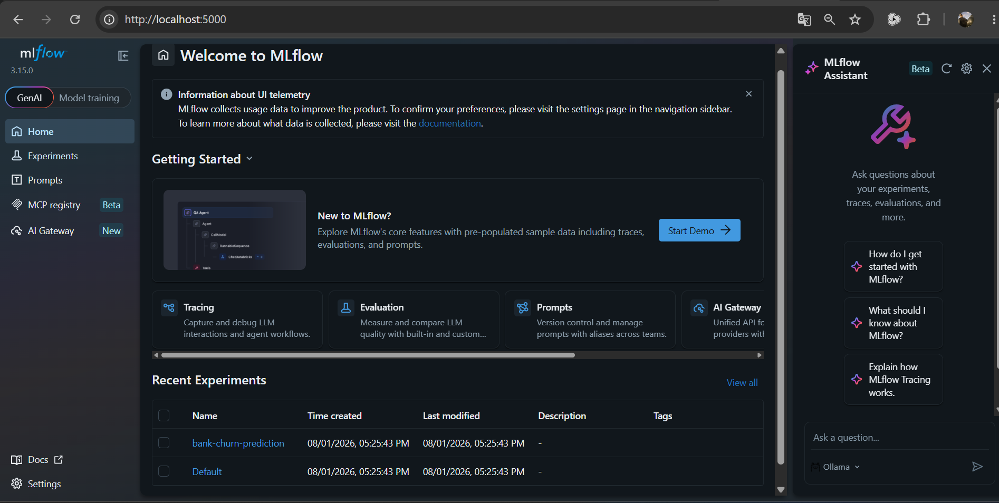
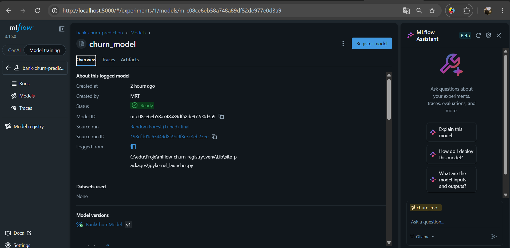
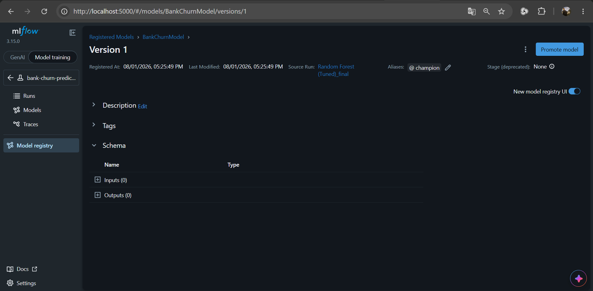
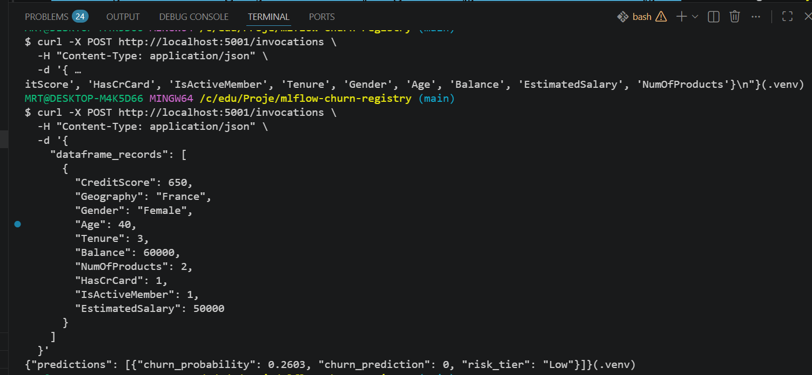

# MLflow Churn Registry

> Production-style MLflow model registry and serving pipeline for a
> bank customer churn model — with champion/challenger promotion,
> quality gates, and full containerization.


## What is this?

A churn prediction model taken from notebook to a **reproducible,
containerized serving pipeline** — the "keep it running" half of ML
engineering that most portfolio projects skip.

It packages the model as a self-contained MLflow `pyfunc`, serves it
through Docker, and governs releases with a **promotion gate**: a new
model is only promoted from `@challenger` to `@champion` if it passes
leakage, performance, and overfitting checks — every decision logged
for audit.

The emphasis is **banking-grade reliability**: reproducibility,
governance, rollback, and evidence — not just model accuracy.

## Architecture

The pipeline separates three concerns: **training** (notebook → registry),
**governance** (promotion gate), and **serving** (containerized API).
Serving always reads whatever `@champion` points to — model updates are
just an alias move, no code change.



> The dashed `smoke_test → gate` arrow is **sequence, not a call**:
> the two scripts are independent (single responsibility). The runbook
> chains them (`smoke_test.py && promote.py`); neither calls the other.

**Bootstrap order** (enforced via Docker Compose profiles):

1. `docker-compose up` → tracking server only
2. Run notebook → model registered as `@challenger`
3. `smoke_test.py` → validate served response
4. `promote.py` → gates pass → `@champion`
5. `docker-compose --profile serve up` → serving starts (champion now exists)

## Evidence

Every claim below is backed by reproducible proof in
[`docs/demo-evidence/`](docs/demo-evidence/).

| What | Proof |
| --- | --- |
| Tracking server + experiments |  |
| Model registered (`BankChurnModel v1`) |  |
| `@champion` alias assigned |  |
| Served model returns prediction on raw input |  |

**Live pipeline state:** auto-generated by `scripts/generate_evidence.py`
→ [`pipeline-evidence.md`](docs/demo-evidence/pipeline-evidence.md)

**Promotion audit trail:** every promote decision (who / when / why)
→ [`promotion-log.txt`](docs/demo-evidence/promotion-log.txt)

Example served prediction (raw customer data in, risk tier out):

```json
{"predictions": [{"churn_probability": 0.2603, "churn_prediction": 0, "risk_tier": "Low"}]}
```

## Quickstart

**Prerequisites:** Docker Desktop, Python 3.11, Git.

```bash
# 1. Clone and enter
git clone https://github.com/R7Murat/mlflow-churn-registry.git
cd mlflow-churn-registry

# 2. Configure environment (copy template, adjust paths if needed)
cp .env.example .env

# 3. Create a virtual environment and install dependencies
python -m venv .venv
source .venv/Scripts/activate      # Windows (Git Bash)
# source .venv/bin/activate        # macOS / Linux
pip install -r requirements.txt

# 4. Add the dataset
#    Download "Churn_Modelling.csv" (14 columns, 10,000 rows) from:
#    https://www.kaggle.com/datasets/aakash50897/churn-modellingcsv
#    Place it at: data/raw/Churn_Modelling.csv

# 5. Start the tracking server (only)
docker-compose up -d

# 6. Train + register the model (creates @challenger)
jupyter nbconvert --to notebook --execute --inplace \
  notebooks/01_train_and_register.ipynb

# 7. Promote to @champion (runs the quality gates)
python scripts/promote.py

# 8. Start serving (champion now exists)
docker-compose --profile serve up -d

# 9. Verify with a real request
python scripts/smoke_test.py
```

**MLflow UI:** http://localhost:5000
**Serving API:** http://localhost:5001/invocations

Send your own prediction:

```bash
curl -X POST http://localhost:5001/invocations \
  -H "Content-Type: application/json" \
  -d '{"dataframe_records":[{"CreditScore":650,"Geography":"France","Gender":"Female","Age":40,"Tenure":3,"Balance":60000,"NumOfProducts":2,"HasCrCard":1,"IsActiveMember":1,"EstimatedSalary":50000}]}'
```

## Project structure

```
mlflow-churn-registry/
├── notebooks/
│   └── 01_train_and_register.ipynb   # train → register as @challenger
├── scripts/
│   ├── smoke_test.py                 # validate served model (exit 0/1)
│   ├── promote.py                    # quality gates → @champion
│   └── generate_evidence.py          # auto-generate pipeline report
├── docs/demo-evidence/               # screenshots + generated proofs
├── data/raw/                         # dataset (gitignored)
├── mlflow-data/                      # tracking DB (gitignored)
├── mlflow-artifacts/                 # model store (gitignored)
├── Dockerfile                        # MLflow image (server + serving)
├── docker-compose.yml                # tracking + serving (profiled)
├── model_card.md                     # model documentation
├── requirements.txt                  # pinned dependencies
└── .env.example                      # config template
```

## Design decisions

Real engineering choices made during this project — the "why", not just the "what".

**Aliases, not stages.** MLflow's `Staging`/`Production` stages are
deprecated. This project uses the current standard — **aliases**
(`@champion`, `@challenger`) — which decouple *role* from *version*
and allow zero-downtime model swaps (serving reads `@champion`, we just
move the alias).

**Champion / challenger, not per-environment models.** A model's *role*
(champion) lives in the registry; its *environment* (prod/uat) belongs to
infrastructure. Keeping one model with moving aliases guarantees "what you
tested is what you deploy" — no rebuild between test and prod.

**Self-contained pyfunc.** Preprocessing is embedded in the model object
(via cloudpickle), not referenced through `context.artifacts` file paths.
This avoids a cross-platform bug where Windows-logged artifact manifests
use backslash paths that fail to load inside a Linux container.

**Proxy artifact access.** The tracking server runs with
`--artifacts-destination` (proxy mode), so both the host notebook and the
serving container reach artifacts through the server over HTTP — no
host-specific file paths leak into the registry.

**Governance as data.** Leakage checks run at *training* time and are
recorded as a `leakage_checked` tag. The promotion gate verifies the
*evidence exists* — a model without it cannot become champion.

**Fail-closed gates, cheapest first.** `promote.py` checks tag → metric →
overfitting (cheap to expensive), and rejects on any failure. The previous
champion is preserved as `@previous-champion` for rollback. Every decision
is logged for audit.

**Bootstrap via compose profiles.** Serving sits behind a `serve` profile
so it never starts against an empty registry — the "champion must exist
before serving" order is enforced by infrastructure, not just documentation.

## Model documentation

See [`model_card.md`](model_card.md) for performance, intended use,
limitations, and reproducibility notes. Headline metrics: **ROC-AUC 0.858**,
**PR-AUC 0.682** (imbalanced problem, ~20% churn — accuracy alone is
misleading).

## License

MIT — see [`LICENSE`](LICENSE).

---

*Built as a portfolio project demonstrating production ML engineering
practices: reproducibility, governance, rollback, and evidence.*
